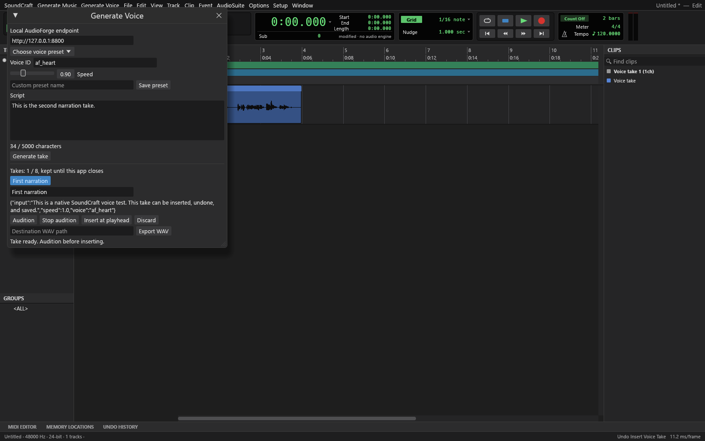
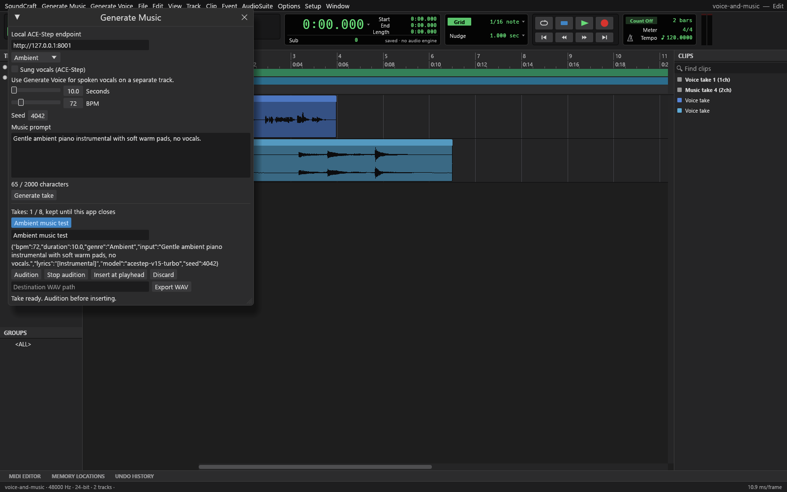
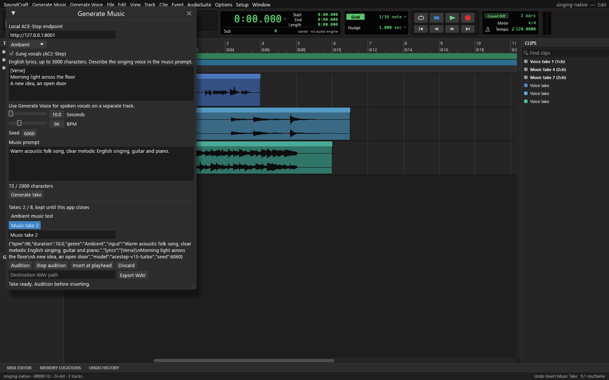

# AudioForge voice preview

This fork adds a native Generate Voice panel backed by the existing local AudioForge/Kokoro speech API. It works independently of CourseForge. The Python bridge uses only the standard library; SoundCraft remains a Rust application.

## Setup

Run an existing local AudioForge-compatible service. The default endpoint is http://127.0.0.1:8800. No remote services or system proxies are used by the bridge.

Set SOUNDCRAFT_AUDIOFORGE_PYTHON to a Python 3 executable and SOUNDCRAFT_AUDIOFORGE_BRIDGE to the absolute path of integrations/audioforge/bridge.py. Open Generate Voice, enter a script and voice ID, generate a take, audition it, and insert it at the playhead. Every insertion creates a new track and can be undone. Save the session to retain audio and generation metadata.

The first adapter targets Kokoro. Speech is requested as WAV with a 5000-character limit and a 25 MB response limit. Generation runs in a background process. Cancellation stops the local client; the provider may finish its outstanding request. No automatic model download or engine startup occurs.

## Automation

- window.generate_voice: open or close the panel
- audioforge.generate: input, voice, speed, endpoint
- audioforge.inspect: job state and completed take
- audioforge.cancel: cancel the local generation client
- audioforge.insert: import a WAV take with input, voice, speed, at, and optional target track

Inserted sources store the provider, source text, voice, and speed. Provider model revision is not currently exposed by AudioForge's speech response and is not invented.

## Current limits

Native desktop only. The next preview includes three original voice-setting presets, up to 20 saved custom presets, and an eight-take list with selection, renaming, WAV export, and discard. Takes last until the app closes; insert and save a session or export a WAV to retain them. No pronunciation dictionary, sentence replacement, automatic engine startup, or approval workflow yet. Audition uses a separate playback instance and is disabled while the session transport is running. Check the build and listening results before using the preview for production.

## Verification

The Windows build at a1982fb passed the native app build and complete `cargo xtask ci` gates: formatting, strict workspace Clippy, workspace tests, assets, architecture layers, and WASM. Six Python tests cover speech and asynchronous music contracts, invalid inputs, failure states, timeouts, cross-origin rejection, WAV conversion, malformed samples, and no-overwrite exports. Four engine regression tests cover voice and music insertion, undo, metadata round trips, and distinct saved take files.

The native Windows smoke test passed voice preset application, custom preset save and reload, two takes with immutable settings, selection and rename, export without overwrite, discard, real music and singing generation, genre and lyric persistence, undo, save/reopen, and mix export. All three panels were captured and visually checked. Five local music demos were emailed, including original sung acoustic pop and a requested female alternative post-hardcore demo. Jason approved the Kokoro voice sample and the shoutcore demo by listening. Native speaker audition playback has not been separately verified.

## Music and singing preview

The music panel targets the official ACE-Step 1.5 local API at http://127.0.0.1:8001. Set SOUNDCRAFT_MUSIC_BRIDGE to the absolute path of integrations/audioforge/music_bridge.py, and optionally SOUNDCRAFT_MUSIC_ENDPOINT. The Python executable setting is shared with the voice bridge. Install and start ACE-Step separately using its [official setup](https://github.com/ACE-Step/ACE-Step-1.5).

The adapter submits and polls one asynchronous task, then downloads a WAV only from the same local service. Prompts are limited to 2000 characters, durations to 10 to 60 seconds, and audio to 25 MB. The preview uses the 2B turbo model with eight inference steps, a fixed seed, and no optional LM. Instrumental mode uses the instrumental tag; sung-vocal mode sends your English lyrics, up to 3000 characters. No paid service or Railway deployment is used.

Music commands: window.generate_music, musicforge.generate, musicforge.inspect, musicforge.cancel, and musicforge.insert. Both providers expose take_select (index), take_rename (name), take_export (path), and take_discard. Voice also exposes audioforge.preset_save and audioforge.preset_apply (name).

Inserted music sources retain prompt, provider, model configuration name, requested duration, BPM, seed, genre, and supplied lyrics. Exact model weight revisions are not exposed by this API and are not claimed; a seed alone does not promise identical results across engine versions. Generated music quality needs listening review.

### Genres and spoken vocals

The music panel offers original editable prompt presets for Ambient, Lo-fi hip-hop, Cinematic, Electronic, Acoustic folk, Jazz, and Rock. Choosing a preset fills its prompt and suggested BPM. The chosen genre accompanies the prompt sent to ACE-Step and is saved in source metadata. Automation uses musicforge.preset_apply with a name.

For spoken vocals, generate a voice take in Generate Voice and insert it on a separate track over the music. Use the normal timeline, mixer, and mix export to arrange and balance them. Kokoro TTS produces speech, not sung pitch-controlled vocals. Enable Sung vocals in Generate Music to use ACE-Step for singing with English lyrics. Describe the voice character in the prompt. The generated song is one mixed take; estimated vocal stems are available through the [remix workflow](remix-workflow.md). Separate singers, precise lyric alignment, chosen TTS voice identity for singing, and automatic speech ducking remain future work.
