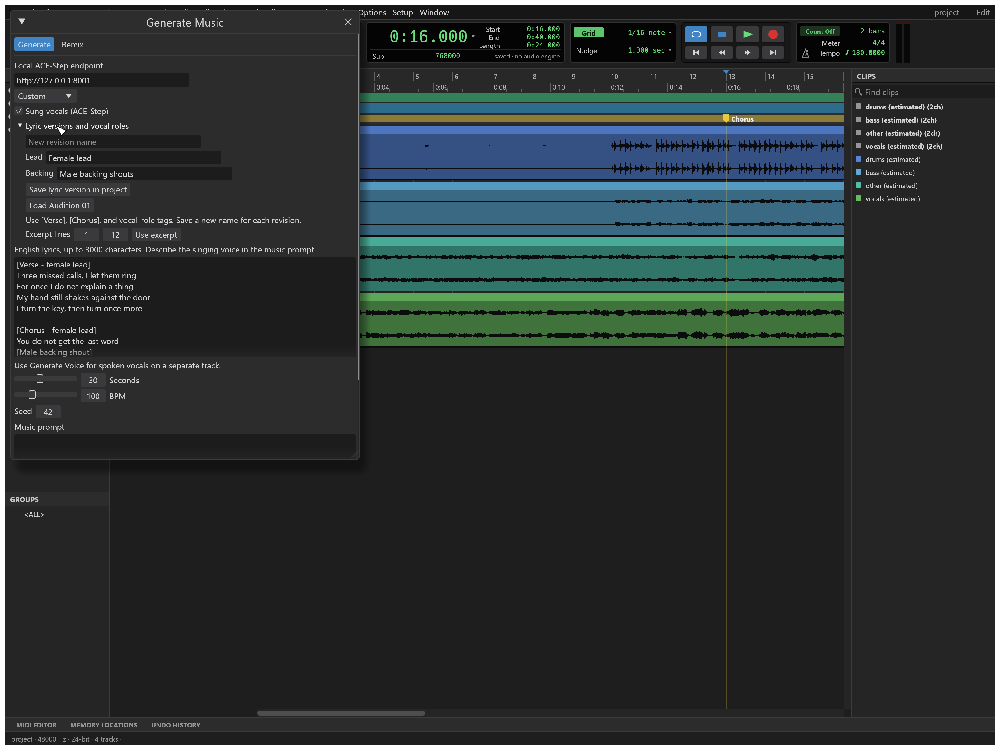
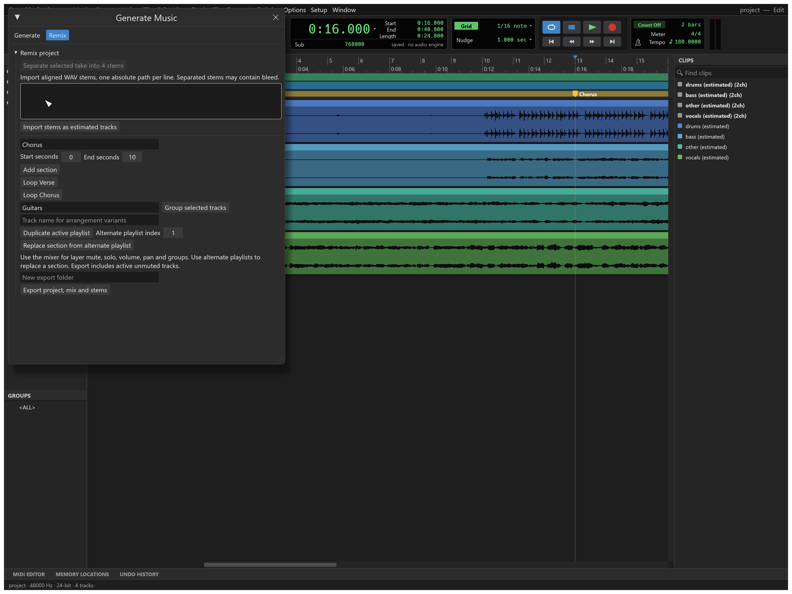

# Lyrics and remix workflow

The Generate Music panel now supports four connected workflows. These features are a development preview.

## 1. Versioned lyrics

Enable Sung vocals and open Lyric versions and vocal roles. Write section tags such as `[Verse]`, `[Chorus]` and `[Breakdown]`, and label lead and backing parts in the lyric text. Save a uniquely named revision with lead and backing role descriptions. Revisions are immutable and saved in the `.scraft` session; editing the working text does not change a saved revision. Use a new name to save another version. Up to 32 revisions, each up to 3000 characters, are supported.

Load a saved revision, then use the inclusive line range to select a generation excerpt. Loading restores its vocal-role notes. Vocal roles are appended to the music prompt when sung vocals are enabled. Use role tags in the lyrics to describe where each voice enters. The combined prompt and roles must fit within 2000 characters. They do not guarantee a particular singer or voice identity.

Commands: `lyrics.save_version`, `lyrics.versions`, and UI command `musicforge.lyrics_load`.

## 2. Originals and estimated stems

Every successful music generation archives its original WAV and immutable generation settings under the SoundCraft preferences folder's `Generations` directory. The status line shows its location or any archive failure. This archive is separate from the temporary take list and survives app closure. Insert and save a session for an editable timeline project.

Select a music take, open the Remix tab, and choose Separate selected take into 4 stems. The asynchronous CPU worker uses TorchAudio Hybrid Demucs, producing vocals, drums, bass and other. First use downloads approximately 319 MiB of model weights from PyTorch. Generation and separation share a cancellable job slot; separation runs outside the realtime audio callback. Configure:

- `SOUNDCRAFT_STEM_PYTHON`: Python executable with compatible Torch and TorchAudio.
- `SOUNDCRAFT_STEM_BRIDGE`: absolute path of `integrations/audioforge/stem_bridge.py`.

The existing local music runtime can be used. No Rust dependency was added. The worker accepts mono/stereo PCM16 WAV up to 25 MB and 60 seconds. It processes overlapping chunks on CPU, preserves alignment, writes 44.1 kHz stereo PCM16 WAV, and applies a shared gain only if needed to avoid clipping. Files are labeled estimated; guitar/synth separation and separate female/male vocal stems are not available.

Import the returned paths to create aligned tracks at sample zero. Import is one undoable command and rejects unequal lengths after resampling without retaining a partial import. Imports from the selected generated take retain generation provenance. Save or export the project before closing: worker files are temporary. Mute the original mixed track when auditioning the stems together to avoid doubling the song.

Commands: UI `musicforge.separate`; engine `remix.import_stems` with a `stems` array of `{path,name,estimated}` and optional `generation` provenance.

## 3. Sections and layers

Create a named section with start/end seconds. This uses the existing selection-marker system and saves with the session. Loop a section, then use transport Play Selection to audition it. Use the normal mixer to mute, solo, pan and balance each layer. Group selected tracks to reuse linked editing/mixer behavior; groups persist in the project.

For alternatives, enter a track name and duplicate its active playlist. Edit that alternate, then promote the requested range back into the main playlist using Replace section from alternate playlist. Playlist indices are zero-based. The existing engine command replaces only the given range and supports undo. It does not regenerate audio or align a new performance automatically.

Commands: `remix.section`, `remix.loop_section`, existing `track.group`, `track.playlist_duplicate`, `track.playlist_promote` and mixer commands.

## 4. Compare and export

Mark two generated takes as A and B, then switch between Hear A and Hear B. Each audition starts at sample zero, using one preview player; stop session transport before auditioning. Discarding a marked take clears its comparison slot. This is sequential audition, not loudness-matched or sample-synchronized switching.

Export project, mix and stems creates a new folder containing `project.scraft`, its Audio Files, `mix.wav`, a Stems directory, and `manifest.json`. Exports cover sample zero through the session content end, up to ten minutes. Stems render active unmuted audio/instrument/MIDI tracks through the existing mix path. Stable track IDs prevent duplicate sanitized filenames. A mixed generated song still exports as a mixed track until separated.

The manifest retains tempo, key signatures, lyric revisions, markers, groups, source generation metadata, and track mixer settings. Existing folders are rejected. A failed export leaves an explicitly reported incomplete folder for inspection; it does not overwrite or delete an earlier export. The open document and its save location are unchanged.

Commands: UI `musicforge.compare_mark`, `musicforge.compare_audition`; engine `remix.export`.

## Verification and limits

Workspace CI and nine Python bridge tests pass. A native smoke test exercised two generated takes, immutable archives, A/B slots, separation, aligned imports, groups, section loops, playlist promotion, provenance, export and reopening. Speaker playback was not independently verified.

The local 40-second Last Word demo has been separated into four aligned stems and exported as a native remix project. Technical signal and alignment checks do not verify separation quality, lyric diction, or male/female voice assignment. Those need listening review. Precise lyric timing, independently generated coordinated instruments, separate singers, and automatic level matching remain future work.

Model and method reference: [TorchAudio Hybrid Demucs tutorial](https://docs.pytorch.org/audio/2.7.0/tutorials/hybrid_demucs_tutorial.html). The model and runtime are downloaded separately; no third-party recordings or model weights are bundled in this repository.
