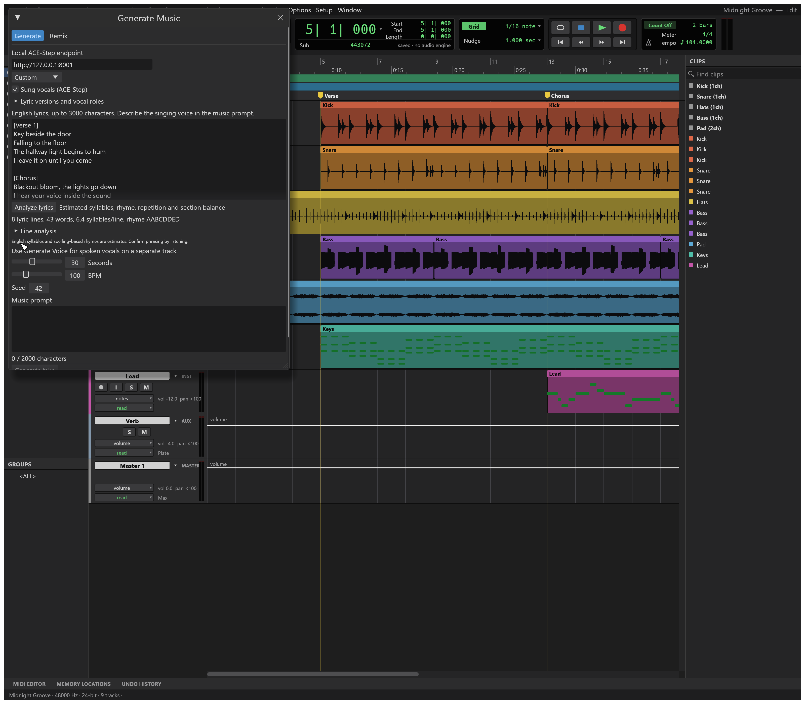

# Songwriting assistant

SoundCraft now combines a reusable project-local songwriting skill with deterministic lyric analysis in the Generate Music panel. Both pieces are local and generator-agnostic.

## SoundCraft Songwriting skill

The skill lives at `.agents/skills/cardona-songwriting`. Compatible agents can select it automatically for original song lyrics, revisions, hooks, section planning, vocal roles and generator-ready packages. It supports four modes:

- new song planning from promise, speaker, listener, moment, hook and recurring image;
- focused revision that preserves the user's strongest material;
- evidence-based lyric audits;
- SoundCraft packages with production direction, vocal roles and section-tagged lyrics.

The main skill routes complete packages to `references/song-spec.md` and revisions to `references/revision.md`. `references/sources.md` records the permissively licensed open-source projects that informed the workflow. The instructions and examples in this repository are original; no third-party lyrics, book quotations, training sets or model weights are bundled.

## Analyze Lyrics

Enable Sung vocals, enter English lyrics, then choose Analyze lyrics. The dependency-free Python helper returns a schema-versioned JSON report containing:

- section and vocal-cue recognition;
- estimated syllable and word counts for each lyric line;
- conservative spelling-based end-rhyme groups and a rhyme scheme;
- exact repeated-line counts;
- lines at least four syllables above or below the song median;
- section line counts, average syllables and rhyme patterns.

The summary stays visible beneath the editor. Expand Line analysis to inspect individual lines. If the working lyric changes, SoundCraft labels the previous report as belonging to an earlier draft.

UI/control command: `musicforge.lyrics_analyze`. Pass `{}` to analyze the current working lyric, or `{"lyrics":"[Verse]\nAn original line"}` to set and analyze text through the control channel. `musicforge.inspect` includes the current `lyric_analysis` report.

Set `SOUNDCRAFT_LYRIC_ANALYZER` to `integrations/audioforge/lyric_analysis.py`. The analyzer uses `SOUNDCRAFT_LYRIC_PYTHON`, falling back to `SOUNDCRAFT_AUDIOFORGE_PYTHON`. It performs no network requests and has no third-party Python dependency.

## Limits

The first analyzer deliberately reports estimates. English names, dialect, contractions, pronunciation changes and sustained sung vowels can differ from spelling. The rhyme groups are conservative spelling matches rather than CMU-dictionary phonemes. The tool does not yet infer stress-aware meter, find internal rhymes, suggest replacement words, score originality, align words to a melody, or timestamp lyrics against generated audio.

Use the report to locate places worth listening to and revising. It does not grade a lyric or decide whether an intentional irregularity is wrong.

Future work can add an optional phonetic backend, ranked rhyme and line alternatives, melody-aware stress checks, and local lyric-to-audio alignment without changing the saved lyric revision format.
